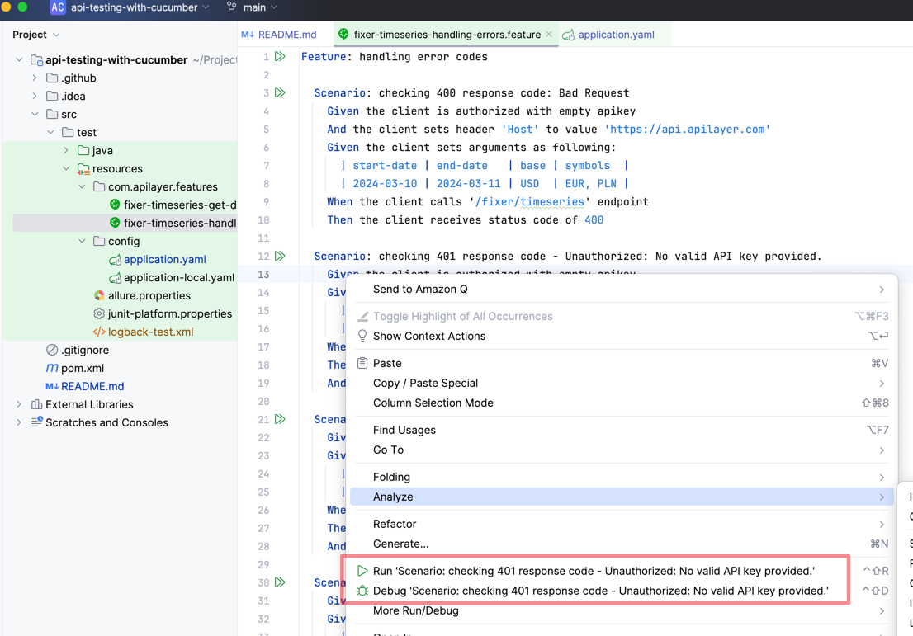
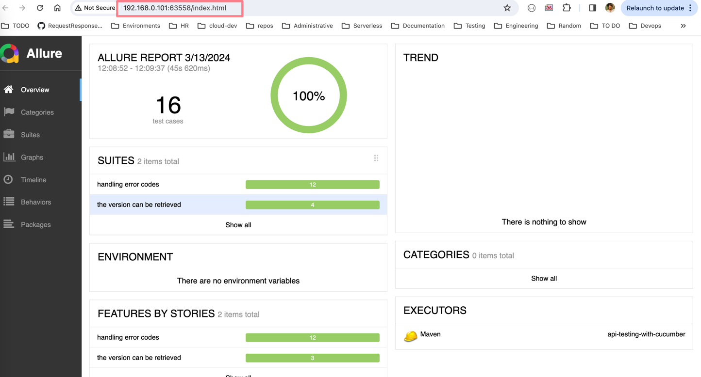
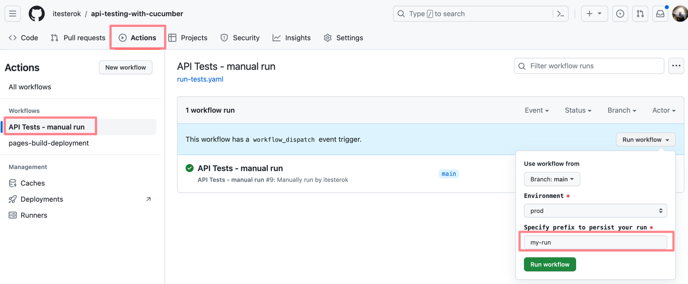
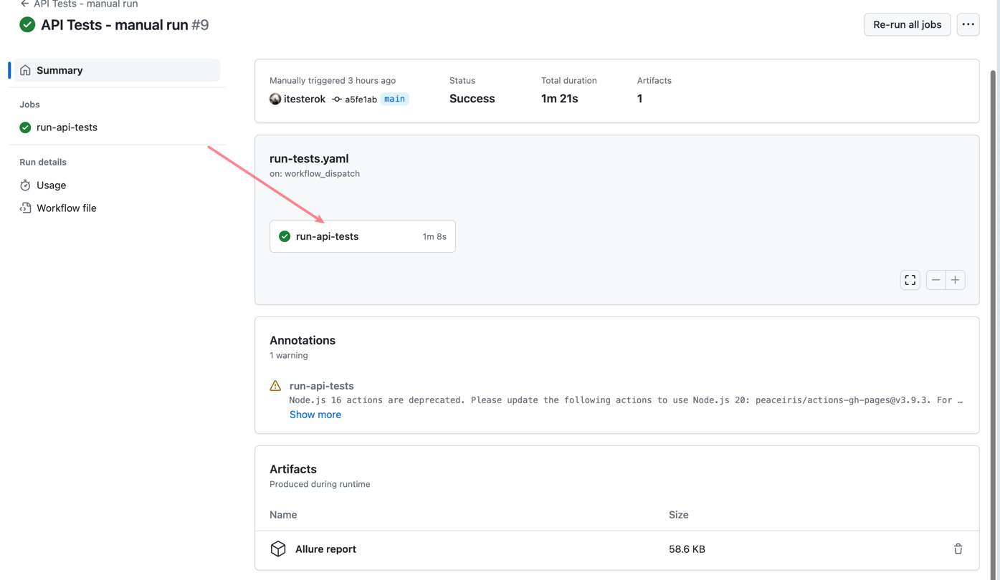
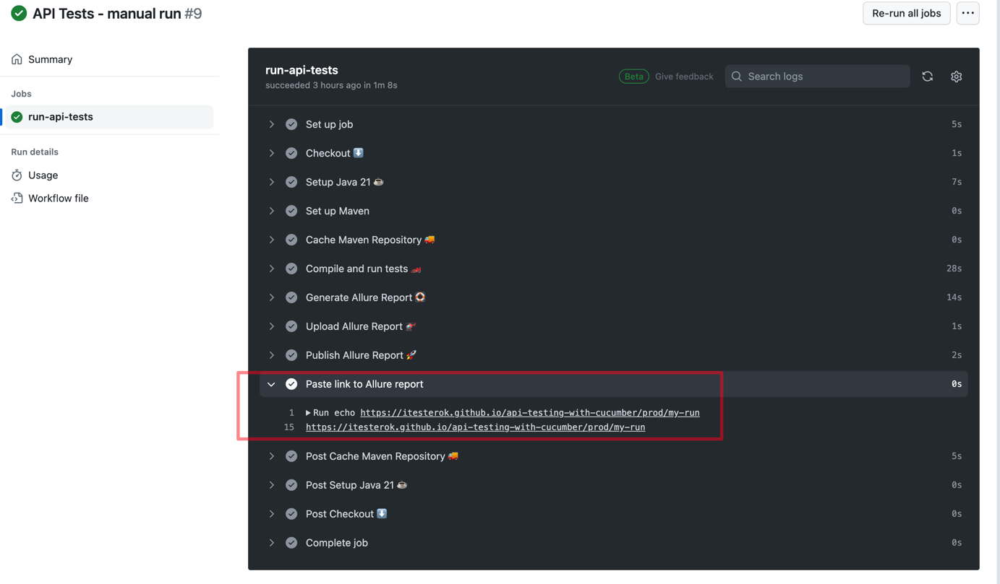
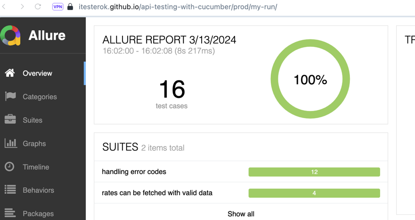
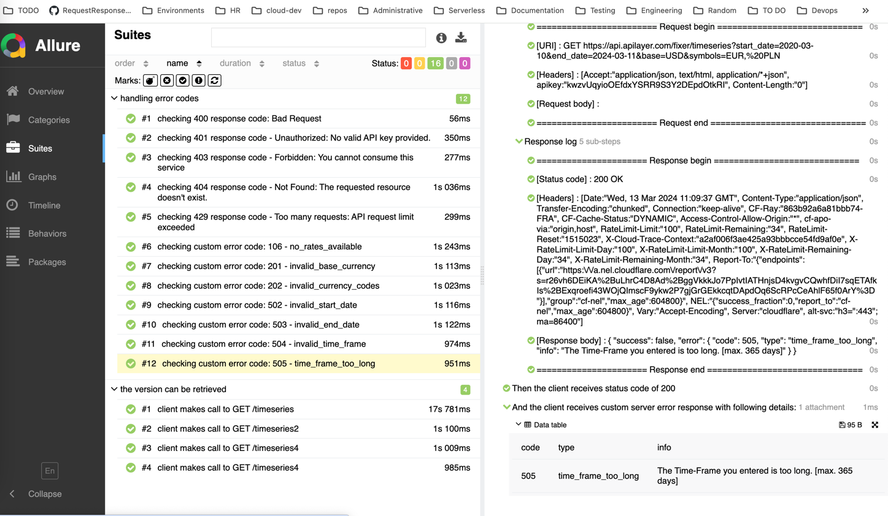

# api-testing-with-cucumber

## Description

This is a ***demonstration*** Test Automation Framework for REST API testing with **Cucumber** + **SpringBoot** +
**RestTemplate** + **JUnit 5** + **Allure**.

The purpose of this solution is to provide a general overview of tools mentioned above and connect them together to
tailor an imaginary project's specific needs.

That is not a complete project since it among others aspects misses such important as:

* automatic user management
* retry mechanism on network issues
* exhaustive list of test cases
* integration with notification systems

As an API counterpart is used this service: [API Marketplace](https://apilayer.com/) which provides a set of APIs which
are easy to consume and to interact with.

More concrete, we'll be interacting with [Fixer API Currency](https://apilayer.com/marketplace/fixer-api).

Documentation is available here:

We'll be testing the ```GET /fixer/timeseries/``` endpoint which returns historical data for exchange rates.

We'll cover all the most common response codes, both positive ones as 200, and error codes as 400, 401, 403, 404,
429 (which IMHO is misused on the service), and custom error codes such as 106, 201, 202, 502, 503, 504. 505.

As it was already stated, and to highlight this again, that's not intended to be a complete list of test cases, but
rather as a demo which serves a purpose of showing the example of usage.

## Prerequisites

- Java 17+
- Maven 3

## Setting up

In order to use the framework locally, you need to:

1. Clone the framework ```git clone https://github.com/itesterok/api-testing-with-cucumber.git```.
2. Configure environment variables ```FIXER_API_KEY; NUMBER_VERIFICATION_API_KEY; FIXER_API_KEY_EXPIRED``` which stands
   for **valid api key for [Fixer
   API](https://apilayer.com/marketplace/fixer-api?utm_source=apilayermarketplace&utm_medium=featured)**; **valid api
   key
   for another service, not fixer API, for
   example [Number Verification API](https://apilayer.com/marketplace/number_verification-api)**; **expired api key for
   Fixer API, meaning such api key which exhausted its usage limits**. For the purposes of configuration either export
   the variable, i.e. ```export FIXER_API_KEY='-your-fixer-api-key-';``` either create ```application-local.yaml``` file
   and put it inside ```resources/config``` folder, then specify ```spring.profiles.active: local```
   in ```application.yaml``` file. For demo purposes, the ```appplication-local.yaml``` file is provided and committed.
3. You might want to use your own api key for Fixer API and Number Verification API. If you don't have yet such api
   key, you have to obtain it by creating an account on https://apilayer.com/ and subscribing to these services.

## Local Run / Debug

1. Cucumber tests written as a feature files using [Gherkin](https://cucumber.io/docs/gherkin/reference/) placed
   inside ```resources/com.apilayer.features``` directory and devided by two files: one with positive tests and one with
   negative tests.
2. You should be able to run / debug them through your IDE, i.e. from Intellij
   IDEA. 
3. You can either run / debug the single test, the entire file or all the files at once.

## CI / CD Run

1. Since Cucumber tests are run by JUnit you can use ```mvn clean test``` to run all the tests
2. When run that thay, an Allure report is autogenerated and placed inside ```target/allure-report``` directory.
3. To see the report locally you can use ```mvn allure:serve```. The report will be rendered and served from
   localhost:

## On demand run from GH Actions

1. In this repo it's set up a GH Actions workflow which enables triggering the tests on demand. To use this option
   please go to Actions -> API Tests - manual run and run the workflow 
2. You can specify the prefix so that your run will be persisted using gh pages.
3. Gh pages allows to see the live report from each run, to find the link open the last
   run  and
   check this step output 
4. In general, the link is the following https://itesterok.github.io/api-testing-with-cucumber/prod/my-run/ where 'prod'
   refers to environment (curently only prod is available) and 'my-run' is the prefix run you specified in prior steps.
5. Following the link you can find the live report which look the same as the local
   report 
6. So that you can use the whole power of **Allure Report
   ** - [#1 Automation Test Reporting Tool](https://allurereport.org/)
7. Also, it's implemented a request / response logging feature so that you can see the interaction with the service what
   should make a debug easier 

## That's it! easy testing :) 